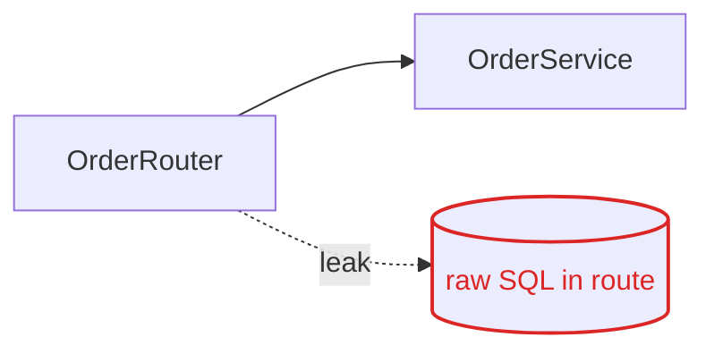
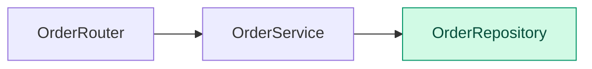

# <Report title> — <slug>

- **Type:** feature | refactor | audit | security | test
- **Date:** YYYY-MM-DD
- **Status:** done
- **Trace:** [scope](../plans/<slug>/scope.md) · [research](../research/<slug>.md) · [plan](../plans/<slug>/plan.md) · [progress](../plans/<slug>/progress.md)

## 1. Summary

<what was asked, what was done, headline result in 3–5 lines>

| Critical | High | Medium | Low | Info |
|----------|------|--------|-----|------|
| 0 | 0 | 0 | 0 | 0 |

## 2. Scope

- **In:** 
- **Out:** 
- **Depth:** 
- **Constraints:** 

## 3. Method

- Tools: 
- Checklists / standards: 

## 4. Current → Target

<!-- refactor / feature / structure / test: required. audit / security: delete this section. -->
<!-- Patterns and colours: ../references/VISUAL-REPORT.md -->

### Current



### Target



**Problem:** <one sentence>
**Change:** <one sentence>

<!-- structure: replace the diagrams with two tree blocks, prefix lines + added, ~ moved, - removed -->

| Metric | Before | After | Δ |
|--------|--------|-------|---|
|        |        |       |   |

## 5. Findings

<!-- audit / security -->
| ID | Severity | Category | Standard | Location | Evidence | Impact | Recommendation | Status |
|----|----------|----------|----------|----------|----------|--------|----------------|--------|

<!-- refactor: replace the table above with -->
<!-- | Change | Named refactoring | Files | Reason | -->
<!-- feature: replace with what was built, interface, tests added -->

### Finding details

#### <ID> — <title>

- **Severity:** 
- **Standard:** OWASP A0x:2025 · CWE-nnn · ASVS Vn.n.n
- **Location:** `path/to/file.py:42`
- **Evidence:** 

```text
<minimal code excerpt>
```

- **Impact:** 
- **Recommendation:** 

## 6. Verification

| Check | Before | After |
|-------|--------|-------|

## 7. Out-of-scope observations and next tasks

- 
