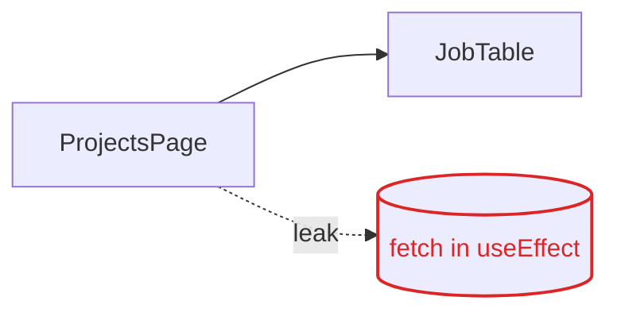
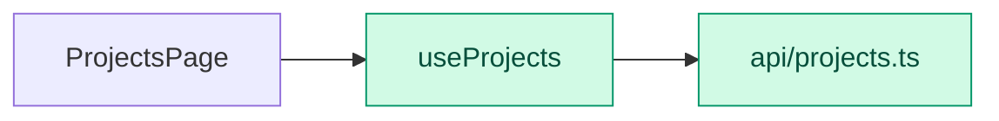

# <Report title> — <slug>

- **Type:** feature | ui | refactor | structure | verify | fix
- **Date:** YYYY-MM-DD
- **Status:** done
- **Trace:** [scope](../plans/<slug>/scope.md) · [research](../research/<slug>.md) · [plan](../plans/<slug>/plan.md) · [progress](../plans/<slug>/progress.md)

## 1. Summary

<what was asked, what was done, headline result in 3–5 lines>

## 2. Scope

- **In:** 
- **Out:** 
- **Depth:** 
- **Constraints:** 

## 3. Method

- Tools: 
- Checklists / standards: 

## 4. Current → Target

<!-- required for every frontend report -->
<!-- Patterns and colours: ../references/VISUAL-REPORT.md -->

### Current

### Target

**Problem:** <one sentence>
**Change:** <one sentence>

<!-- structure: replace the diagrams with two tree blocks, prefix lines + added, ~ moved, - removed -->

| Metric | Before | After | Δ |
|--------|--------|-------|---|
|        |        |       |   |

## 5. Changes

<!-- refactor: | Change | Named refactoring | Files | Reason | -->
<!-- feature / ui: what was built, components reused vs added, states covered -->

| Change | Files | Reason |
|--------|-------|--------|

## 6. Verification

| Check | Before | After |
|-------|--------|-------|

## 7. Screenshots

<!-- one row per page; relative links into agent-tracking/screenshots/<slug>/ -->

| Page | 375 | 768 | 1024 | 1440 | 1920 |
|------|-----|-----|------|------|------|
| |  | | | | |

### Design match (image tasks)

| Image | Width | First pass | Final | Deviations applied |
|-------|-------|------------|-------|--------------------|
| agent-tracking/designs/<slug>/<name>.png | | % | % | |

## 8. Docs updated

| File | Section | Change |
|------|---------|--------|
| README.md | | |
| AGENTS.md | | |

## 9. Out-of-scope observations and next tasks

- 
